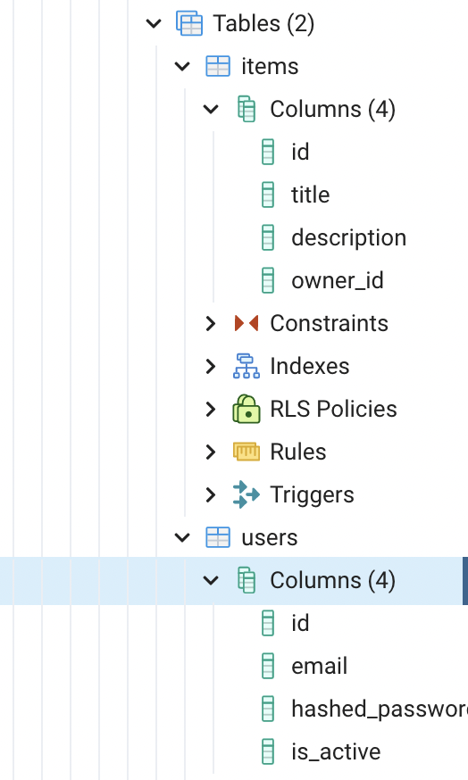

# FastAPI
for practicing FastAPI,  with me, others are join this project

<br>
<br>

# 2022.02.19 Study

<br>

> ## Study of SQLAlchemy and DB, ORM

<br>

----

<br>

> ### Before Start, What you need

<br>

Before start, you need configure .env file.
First make a .env file in this folder.

<br>

```
cd 2022.02.19
touch .env
```

<br>

After you made a .env plz add this command, which fits to you postgresql.

<br>

```
DB_URL = "postgresql://{DB_USER_ID}:{DB_USER_PASSWORD}@{DB_HOST ex) 127.0.0.1}:{DB_PORT ex) for psql default value is 5432}/{DB_NAME}"
```

<br>

By this, you create .env file to save your information safe. And after this study we will add lots of information at here.

<br>

> ### Install python package which are needed at this study

<br>

```
pip install alembic, psycopg2-binary, sqlalchemy
```

If you start this project at a first time, plz use requirements.txt to install

<br>

----

<br>

> ## Using alembic

<br>

### So, what is alembic? 

<br>

alembic is database migration tool to help you convenience. It is based on sqlalchemy.

If you want to start alembic without nothing - even if without this repo - you can start with this command. 

<br>

```
alembic init myproject
```

<br>

Then, you can use this code to start this project and migrate to DB.

<br>

```
from logging.config import fileConfig
from sqlalchemy import engine_from_config, pool
from alembic import context

import models
import os, sys
from dotenv import load_dotenv

BASE_DIR = os.path.dirname(os.path.dirname(os.path.abspath(__file__)))
load_dotenv(os.path.join(BASE_DIR, ".env"))
sys.path.append(BASE_DIR)

config = context.config
<<<<<<< HEAD
<<<<<<< HEAD
config.set_main_option("sqlalchemy.url", os.environ["DB_URL"])
=======
config.set_main_option("sqlalchemy.url", os.environ["POSTGRES_HOST"])
>>>>>>> 30d735e (add fast api)
=======
config.set_main_option("sqlalchemy.url", os.environ["DB_URL"])
>>>>>>> 1b20bef (delete)

fileConfig(config.config_file_name)

target_metadata = models.Base.metadata

```

<br>

Finally you can migrate! Now put this command to your cli.

```
alembic revision -m "My first migrations"
```

<br>

By this command you can create your own basic migration file. But you need to add a some code.

```
def upgrade():
    op.create_table(
        "users",
        sa.Column("id", sa.Integer(), nullable=False, primary_key=True),
        sa.Column("email", sa.String(length=255), unique=True, index=True),
        sa.Column("hashed_password", sa.String(length=255)),
        sa.Column("is_active", sa, Boolean(), default=True),
    )
    op.create_table(
        "items",
        sa.Column("id", sa.Integer(), primary_key=True, index=True),
        sa.Column("title", sa.String(), index=True),
        sa.Column("description", sa.String(), index=True),
        sa.Column("owner_id", sa.Integer(), sa.ForeignKey("users.id")),
    )


def downgrade():
    op.drop_table("users")
    op.drop_table("items")
```

<br>

By adding this command, you can not migrate your own table. Type this command.

```
alembic upgrade head
```

<br>



<br>

Now enter to you pgadmin4 and you can check that DB tables are created.

ALL DONE! Now you can start study with me!