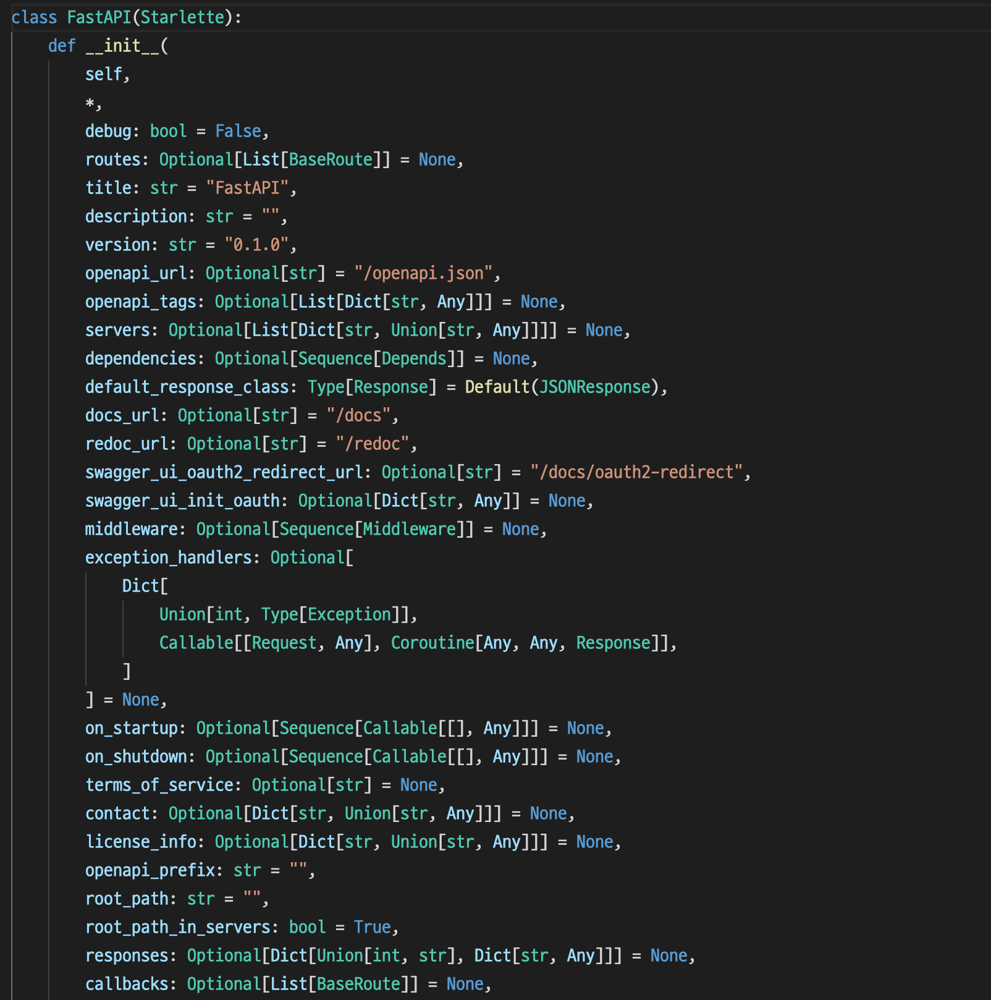
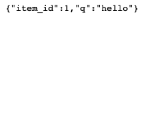
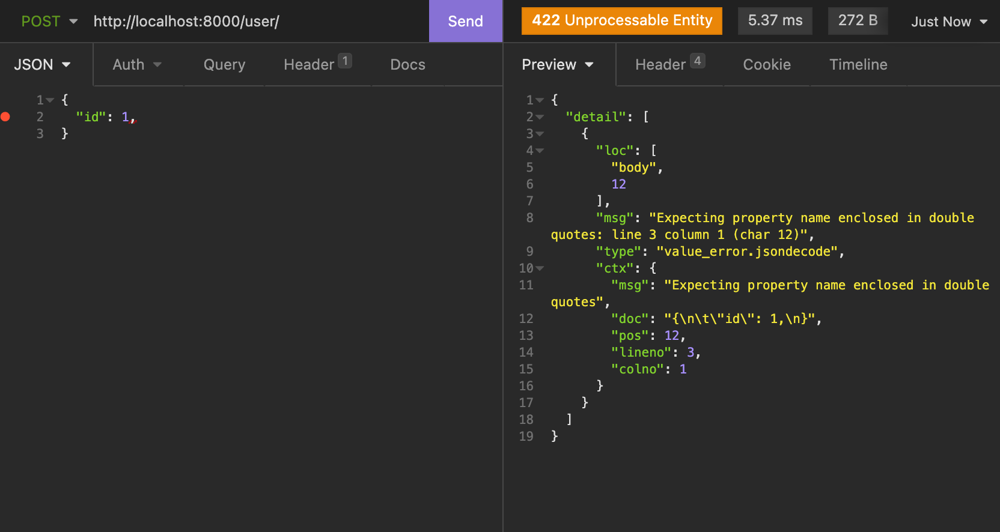

# FASTAPI Repository to study with me


## Study2

<br>

There are 3 function in the main.py and those are our main functions in this study. 

main.py에는 3개의 함수가 있습니다. 그리고 이것들이 저희가 스터디에서 사용한 주된 함수입니다.

<br>

---

<br>

### Study 2 - main function

<br>

```
from fastapi import FastAPI

app = FastAPI()

@app.get("/")
async def main():
    return {"message": "Hello world!"}
```

This is first function that we will make a service by using FastAPI more bigger and bigger. So, how each lines work? First, let's see a 3rd line!

이것이 저희가 사용하게될 함수이며, FastAPI 이용하여 서비스를 더욱 크게 만들기 위한 첫 걸음입니다. 그렇다면 각 라인이 의미하는 것은 무엇일까요? 먼저 3번쨰 줄을 봅시다.

<br>

```
app = FastAPI()
```

This line is most basic type of FastAPI code. By declaring and initializing FastAPI() class to app variable, you can use most of FastAPI(). Inside of this code, it looks like this pic.

이 라인은 FastAPI의 가장 기본타입이 되는 코드입니다. 변수에다가 FastAPI 클래스를 선언하고 할당함으로서 FastAPI()의 대부분을 사용할 수 있습니다. 이 코드 안에는 다음과 같이 구현되었습니다.

<br>



<br>

Lot's of code is contained on this class. But don't worry, you don't need to study how this code is working! Then let's look a next code.

많은 코드들이 이 클래스에 포함되어 있습니다. 하지만 걱정마세요, 이 코드를 전부 공부할 필요는 없습니다. 그렇다면 다음 코드들을 봅시다.

<br>

```
@app.get("/")
async def main():
    return {"message": "Hello world!"}
```

<br>

You can see a python decorator above of main function. Python <b>decorator</b> is really usefull and conviniecne tool to make your code. But, at here we just pass this decorator later. Breifly, decorator is tool that is inserted to function and doesn't change any tools of function, just power up function's tool.

And then, you can see a get("/"). This code means, "When someone call a FastAPI by HTTP GET Method, to a  url endpoint to "/" than I will return some information." I will explain HTTP, Rest, Restful API later. 

By this you build your own server! So how to get a information? 

파이썬 데코레이터가 메인 함수 위에 있는 것을 볼 수 있을 겁니다. 파이썬 데코레이터는 굉장히 편리하고 유용한 툴이지만, 여기서는 넘어갈겁니다. 간단하게, 데코레이터는 함수에 삽입되지만, 함수를의 기능을 해치지 않고 함수를 파워업 시켜준다고 생각하면 좋습니다.

그리고 get("/")을 볼 수 있을 겁니다. 이 코드가 의미하는 것은 "누군가 FastAPI를 부를는데, 그것이 HTTP GET Method이고 url이 아무것도 없이 "/"로 끝나는 엔드포인트면 정보를 넘겨주겠다.", 입니다. HTTP, Rest, RestFul API에 대해서는 나중에 설명하도록 하겠습니다.

이로써 당신만의 서버를 만들게 되었습니다! 그러면 정보를 어떻게 얻어올 수 있을까요?

```
http://localhost:8000/
```

Type this on your browser! By this you can see a text that typed on your code!

이거를 브라우저에 쳐보세요! 이를 통해 코드에 넣은 텍스트가 출력될것입니다!

<br>

---

<br>

### FastAPI query parameter

<br>

```
@app.get("/items/{item_id}")
async def read_item(item_id: int, q: Optional[str] = None):
    if q:
        return {"item_id": item_id, "q": q}

    return {"item_id": item_id}
```

Sometime, you can see a "?" in a url. This "?" means, "I will pass query parameter". You can pass a query parameter like this.

가끔씩 url에 물음표가 있는 것을 보셨을 겁니다. 이 물음표의 의미는 "내가 쿼리 파라메터를 넘길 것이다."를 의미합니다. 이런식으로 쿼리문을 넘길 수 있습니다.

```
http://localhost:8000/items/1?q=hello
```

At here "q" is variable and "hello" is value to this query. And entering to browser, you can check value is added to text.

여기서 "q"가 변수가 되며 "hello"는 값이 됩니다. 그리고 브라우저에 들어가면 텍스트에 값이 찍혀있는 것을 확인할 수 있습니다.

<br>



<br>

---

<br>

### FastAPI pydantic and Request Body

<br>

Pydantic is data validation package and we will use this package by validate Request Body! 

Pydantic은 데이터 검증 패키지로 이를 통해 리퀘스트 바디를 검증할 것입니다.

```
class User(BaseModel):
    id: int
    message: Optional[str] = None
    creation_date: datetime.datetime
```

At this code we can check these informations.

- id and creation_date is required.
- message is not required but if you need you can include.  

When we request without creation_date, then we can get this warn!

이 코드에서 다음과 같은 정보를 확인할 수 있습니다.

- id와 creation_date는 필수다
- message는 필수까지는 아니지만 원하면 넣을 수 있다.

만약 creation_date를 없이 리퀘스트를 보내면 다음과 같은 경고를 받습니다!



```
{
	"detail": [
		{
			"loc": [
				"body",
				12
			],
			"msg": "Expecting property name enclosed in double quotes: line 3 column 1 (char 12)",
			"type": "value_error.jsondecode",
			"ctx": {
				"msg": "Expecting property name enclosed in double quotes",
				"doc": "{\n\t\"id\": 1,\n}",
				"pos": 12,
				"lineno": 3,
				"colno": 1
			}
		}
	]
}
```

<br>

This is very useful part of pydantic! By this you can validate request data convenient! If you have to get a request value which is must included, you can add a variable to a Class!

이것이 pydantic의 유용한 부분입니다! 이를 통해 우리는 리퀘스트 데이터의 증명을 쉽게 할 수 있습니다! 만약 당신이 원하는 정보가 있다면 Class에 넣으면 됩니다!

<br>

---

<br>

## At Study3

We will learn about request body, path, and others.